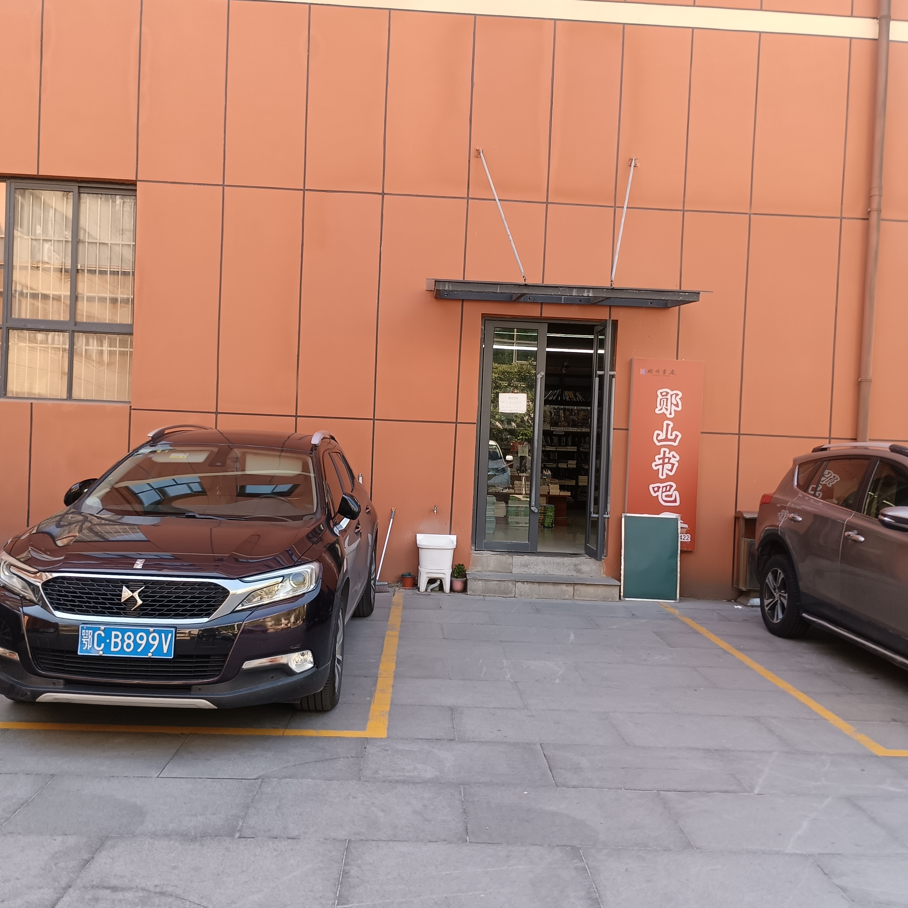
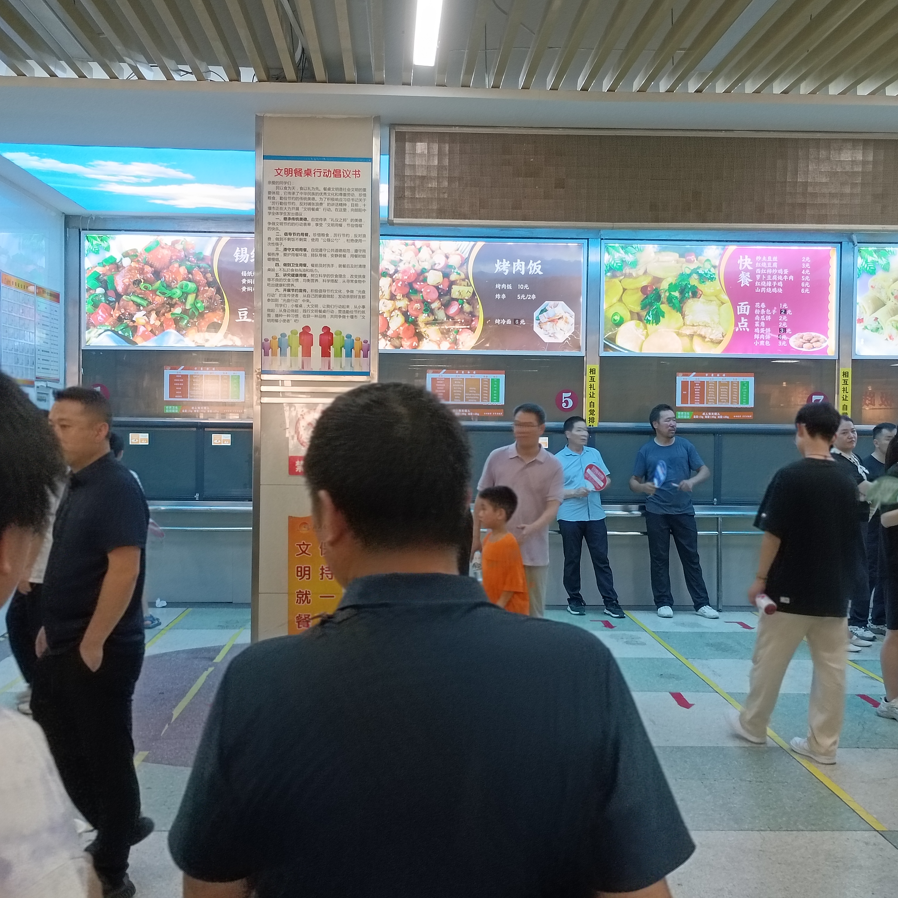
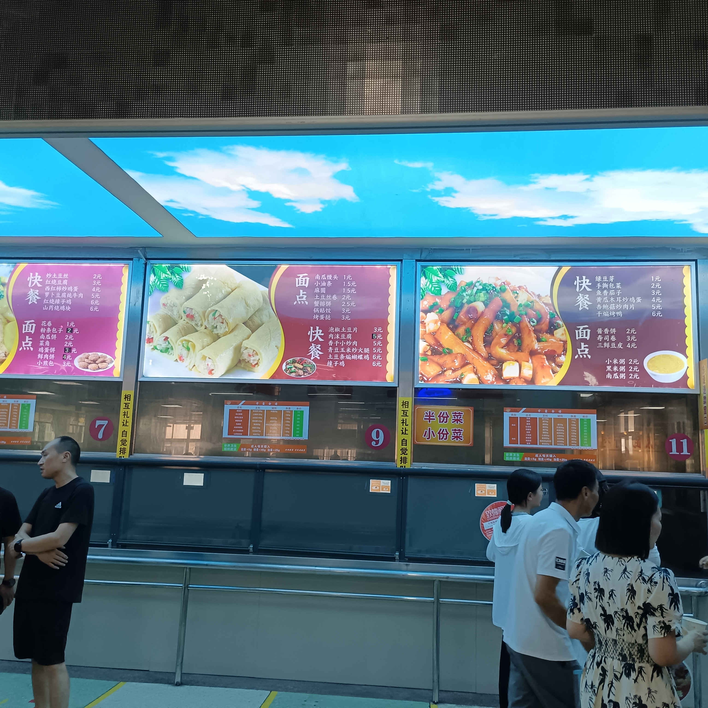
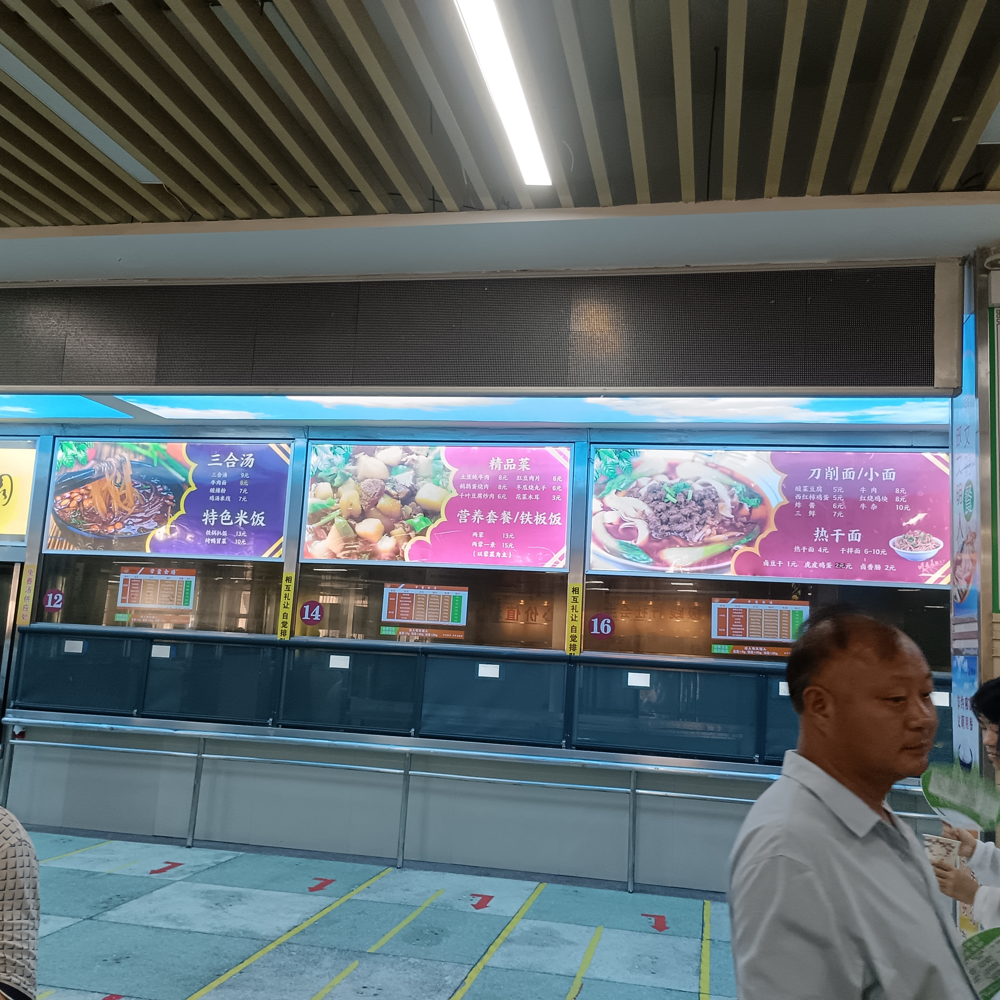
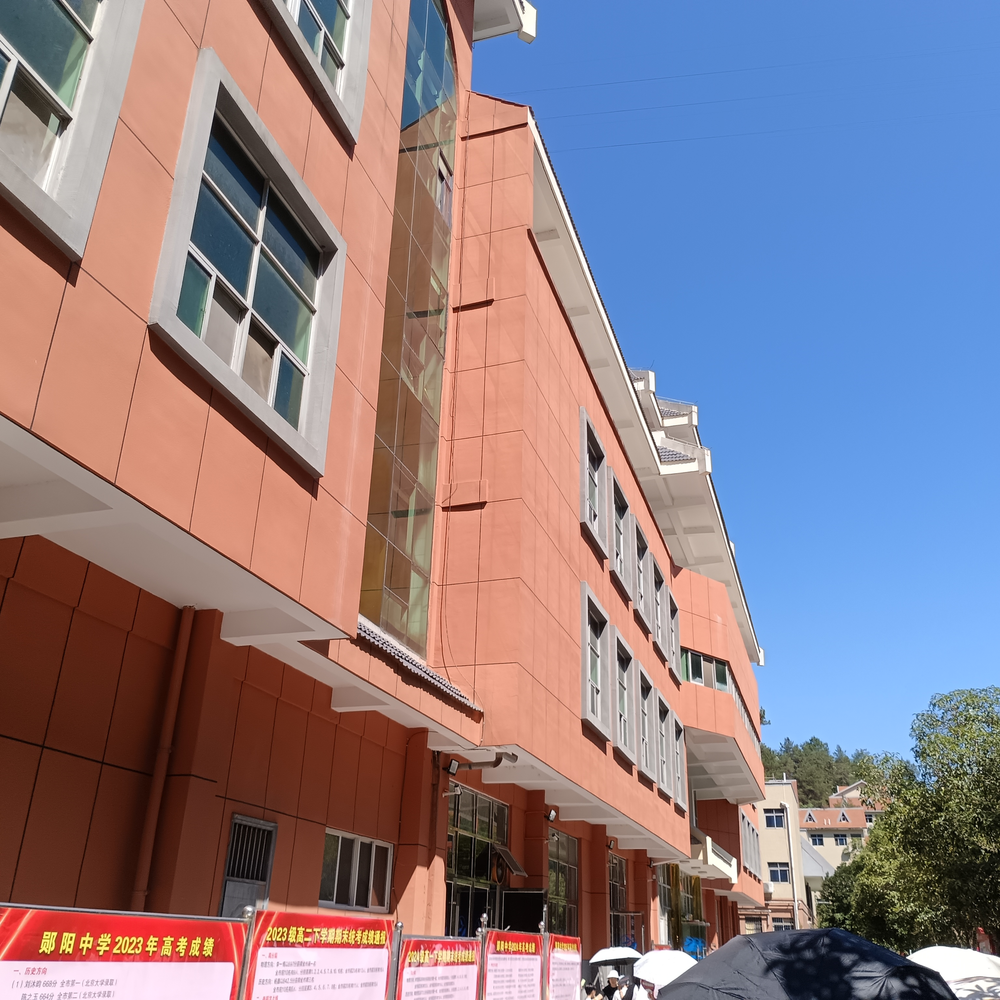
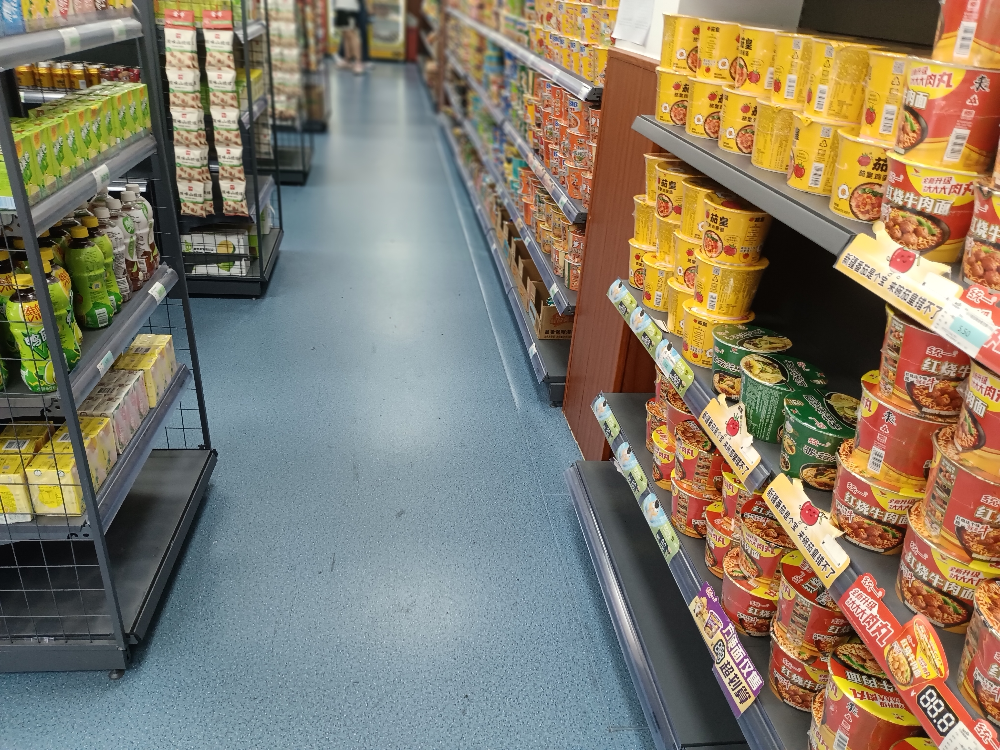
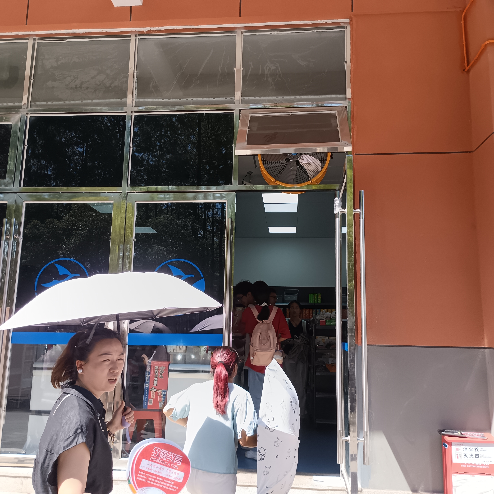
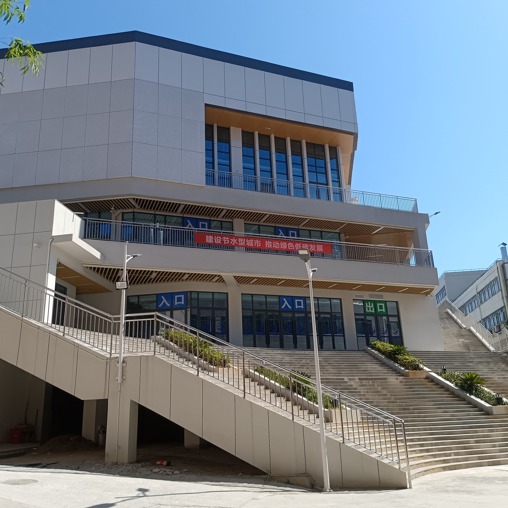
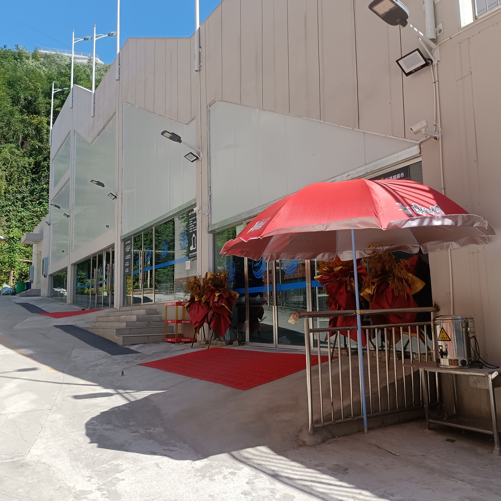

# 学校购物

学校设有超市两处 ***均为万德福分店*** 文具店两家 书店一家 

>一般均采用刷脸支付，但也接受现金/常用移动支付
>超市价格算不上便宜，谨慎消费 ***笔者一次吃晚饭花了21*** 
>书店统一打九折，但如果买成套教辅优先考虑网购 
>书店书非常全，校规上禁止的书都可以有 ***没有可以找老板订*** 杂志之类也很全 可打法时间
>学校不禁止任何地方吃零食，放心大胆买

以上由高松灯提供

