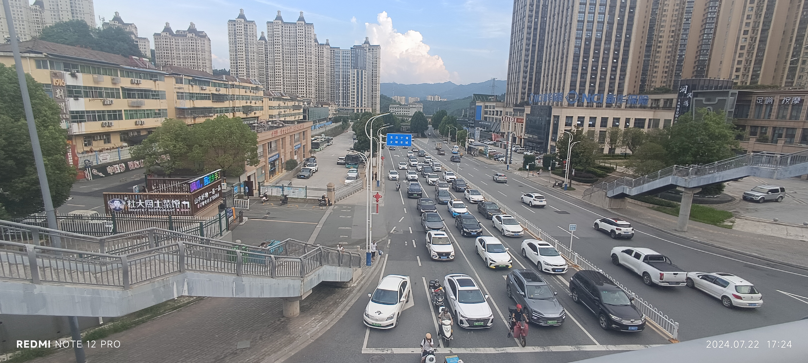
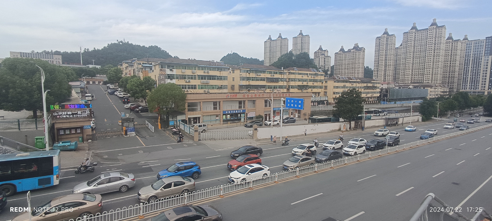
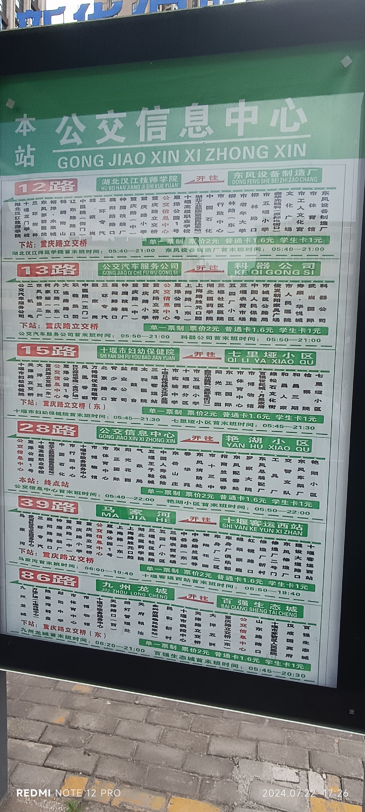
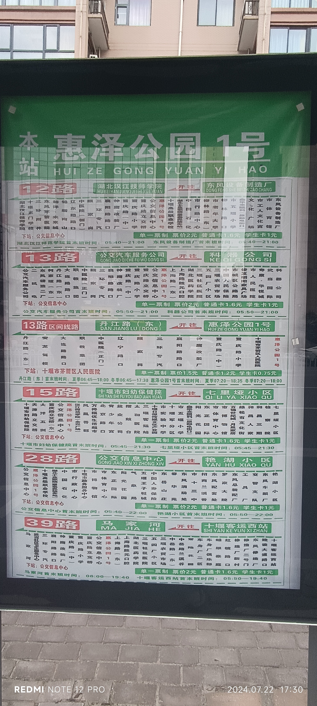
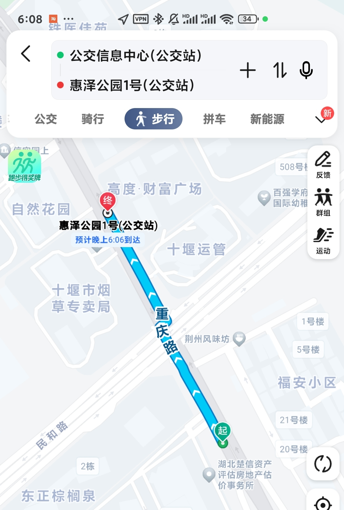
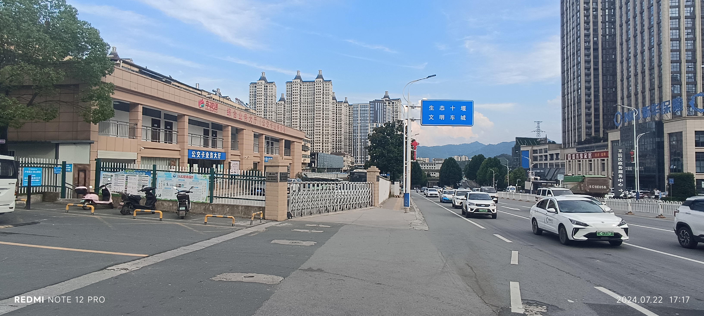
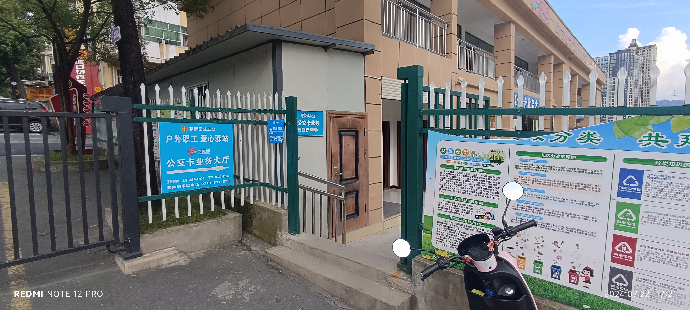
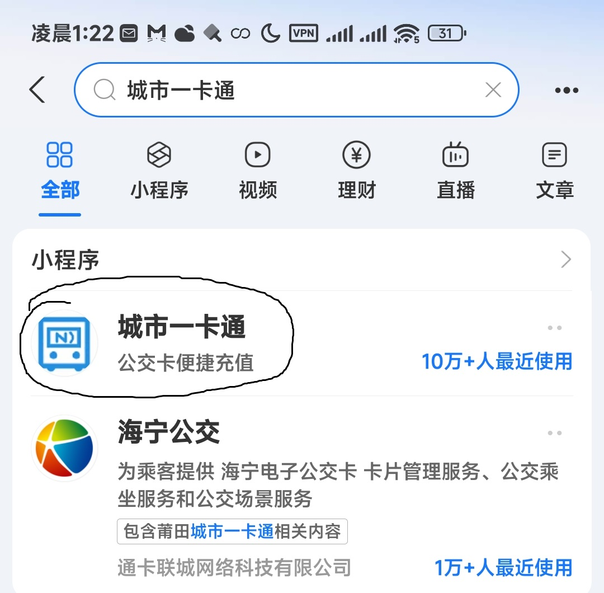
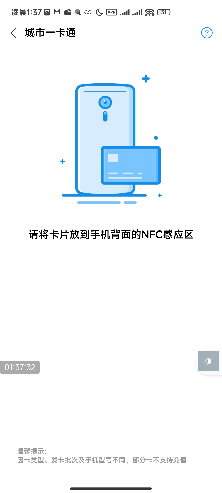

# 办理公交卡（希望卡）
许多五县一市的同学可能没有公交卡，可能认为不太实用，但就个人经历而言，办张票价半价的希望卡还是很方便的，周末假期虽短但出行还是方便一些（有时间出去转转嘛，毕竟读完高中可能就不怎么在城区待了）

感谢𝑫𝒂𝒑𝒉𝒏𝒊𝒔.提供的图片（拍摄于2024.07.22，相当具有时效性）

## 办理地点

> [!WARNING]
> 目的地有点远，建议留出足够的通勤时间。公交信息中心的公交站只是一个牌子，没有电子屏提供车辆信息，且临近始发站，需要您有一点点耐心等待发车（一般不超过10分钟）。请结合**掌上公交**之类的网络平台（微信小程序、支付宝搜索，独立app均可）及时获取公交信息，避免不必要的麻烦与困难。

> [!CAUTION]
> 如果您使用~~缺德~~高德地图进行导航时，请勿输入“公交信息中心”作为目的地，会造成**很大的偏差！！！**如果您坚持使用高德地图，请以“十堰市车城通科技有限公司”为目的地进行导航。（办卡的时候用百度，写文的时候看了眼高德，看傻眼了）

本图中，从天桥左侧下桥直走一小段便是办事处。

公交信息中心，可在**东正国际**西-->东方向公交站（宏正大酒店对面）乘坐28路公交车（**京中方向**） 在**公交信息中心站**下车

附近的公交站还有惠泽公园1号，在天桥对侧

本图拍摄于上图的天桥右侧，经天桥过马路后即可到达

办事处旁的视角

根据导航，前往公交信息中心，此处为主干道，请注意自己的位置，不要迷路。

到站后去人行天桥过马路，沿着路向东南方向走，按照导航走到“十堰车城通科技有限公司”或者下车车站的对向车站附近，可以看到办事大厅。如果实在找不到，可以问一问。

附近也有其它车站，在此列举图片如下：

#### 惠泽公园1号

位置如上图，在路另一侧，天桥另一边

到达图示位置后，请从**侧门**进入。

## 需要携带的办理材料及开卡费用

本人身份证
郧阳中学录取通知书（办理希望卡要用，用来证明自己的学生身份）
1寸（笔者办卡时用了身份证的照片，没有记住要求的照片规格）照片（选配，因为可以直接用身份证照片，没有也不影响办卡，有也可以）
20元工本费及预充值费用（预充值费用看个人，但这是在20元之外的）

到了办理处就和工作人员说办希望卡，这个时候会要求你提供身份证和能证明本人学生身份的材料（比如你的录取通知书，这应该是最好拿的材料了）

## 充值方法
### NFC充值
如果您持有手机且支持**NFC**功能，请在支付宝顶部搜索栏搜索“**城市一卡通**”。充值过程中请尽量保持网络环境稳定
> [!NOTE]
> 关于您的设备是否支持NFC功能，请咨询手机厂商或者查阅资料

点击进入后提示“请将卡片放到手机背面的NFC感应区”

听见手机提示音，表明卡片已被检测到。
> [!CAUTION]
> 从卡片被检测到这一刻起，直到充值完全结束前，**请勿将卡片从手机背面的感应区移开，否则会无法正常写入卡片导致充值失败！！！**

> [!TIP]
> 但如果您真的不小心将卡片拿开了而且扣了款，请不要担心，一般而言24小时内钱款就会原路返回。

选择充值金额。可以选择20，30，50，100，200等固定面额。
选择后付款，付款成功后开始写入卡片
写入完成后，出现绿色对勾，可以移开卡片，充值到此结束。

### 网点人工充值
如果您没有支持NFC的设备，可以找网点进行人工充值。
非常便利，学校对面东正国际的小商场就有充值点。在寿康超市专卖烟酒的柜台，贴有“车城通什么什么东西”字样的服务台，可以拿出公交卡让工作人员给你充值。

### 毕业之后
十堰车城通希望卡实行年检政策，在您注册时，工作人员核验您的剩余在校时长设定有效期（当年入学为3年，以此类推），有效期到后希望卡失效，不再享受半价优惠。

### 站长碎碎念
或许有很多同学觉得，办张不怎么用得到的公交卡，跑这么远，还要交20块钱，实在不划算。但实际上，一张公交卡不仅仅代表着半价优惠，还代表在这个陌生地域的归属，身为城市一员的象征。求学之路孤独，艰苦，也请不要浪费短暂的休息时间，走出学校，看看这座城市的各个角落，不论是衰败的铁轨，还是阔远的景观，充盈自己的内心，不在道路上迷茫，找到自己的方向。
我在高一的时候就办了公交卡，一开始听说在六堰办，从学校坐了好几站公交，到了才发现人家早就转网点了，只剩一张通知。后来去信息中心，又坐了十几站公交，办到手之后，高一高二用的多些，高三用的少，估计总共用了100左右的余额（回本了好耶）。