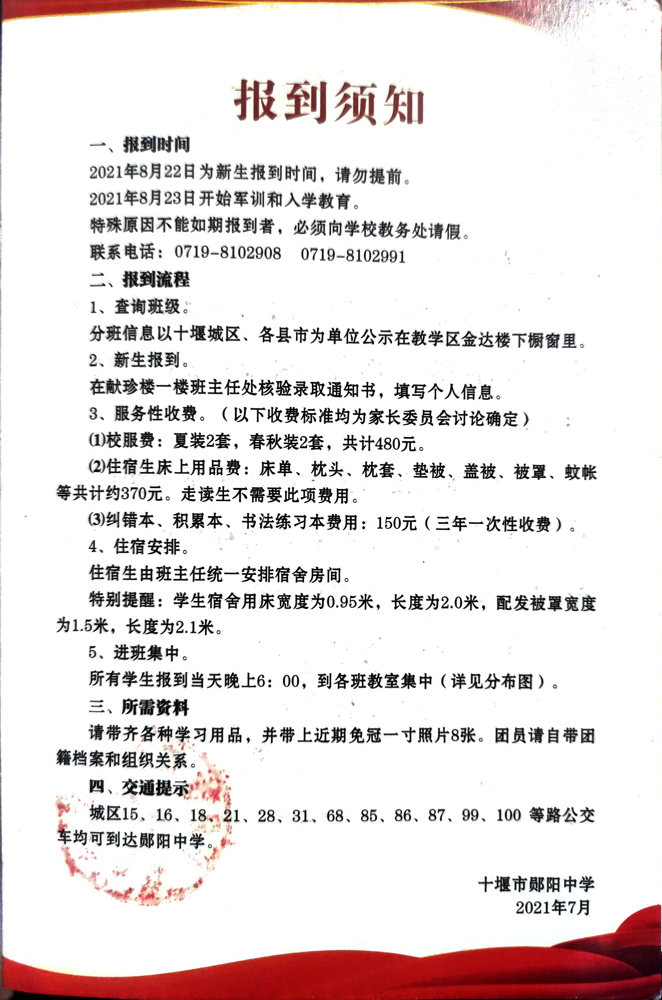

### 住校生入学指南

您可能来自经开区等城区郊区，或是五县一市，现在没有租房走读需求，需要住校，这篇文章将会向您提供住校生的简明入学指南
说起来，郧阳中学的宿舍条件已经高于很多211了

## 关于学校配发
> [!WARNING]
> 请注意，下图截取自**2021**年的郧阳中学录取通知书，属于**已过时信息**，不具有较强的参考意义，具体床上用品费用请以您手中的录取通知书为准

根据报道须知，不需要自带任何床上用品
注：当时配发的床品包括一床凉席，但是须知上未提及，入学新生请以实际情况为准

学校配发的床品 质量还算行，笔者用了三年都没有破损，只是不太符合个人审美。

在办理完毕后，会领到寝室的钥匙，这个时候就可以去寝室准备东西了。
学校配发的物品在**宿舍二号楼或者三号楼**领取（以实际情况为准），二号楼是进宿舍区后右手边的第一栋，三号楼是左手边的第二栋
男同学初次入学会被分配在8号楼，在宿舍区最里边上坡，请根据宿舍编号确定是8-1还是8-2。
女同学则是6号楼，在宿舍斜坡底部左手边。

## 除去学校配发的物品，我应该采买什么?
在入学当天，学校超市会专门售卖相关商品，以下列出商品属于刚需程度较高及以上的商品，请参考学校超市及外部市场价格酌情选购。

### 个人物品

### 寝室柜子锁
保证个人私密物品安全

### 毛巾
洗脸 洗头 洗脚/洗澡 浴巾（如果需要的话）
一般两条就可以了

### 暖水瓶
初入学的8号楼(高一男寝)水龙头没有混水阀门（截至2022年，后续是否安装待补充），需要自行去走廊统一的开水器接开水使用。
一般是人手一个

### 牙膏 牙刷 牙杯 
哪便宜去哪买 学校对面就是超市 牙杯牙刷在学校买倒无所谓 反正都是便宜东西

### 洗衣粉 沐浴露/香皂 洗面奶 洗发水
学校对面就是超市，校内超市也有售卖

### 脸盆
一般两个就行 一个脸盆一个洗脚盆  

### 鞋刷

### 纸巾
不再赘述

### 集体用具
宿舍自带拖把、一个传统笤帚、垃圾桶、垃圾撮

可以一寝室购买一个晾衣叉（2元）
垃圾袋可从阿姨那里取用，但是数量有限，可以自己备一卷

关于寝室条件，请阅读宿舍生活专题

歇逼了睡觉了晚点再写
