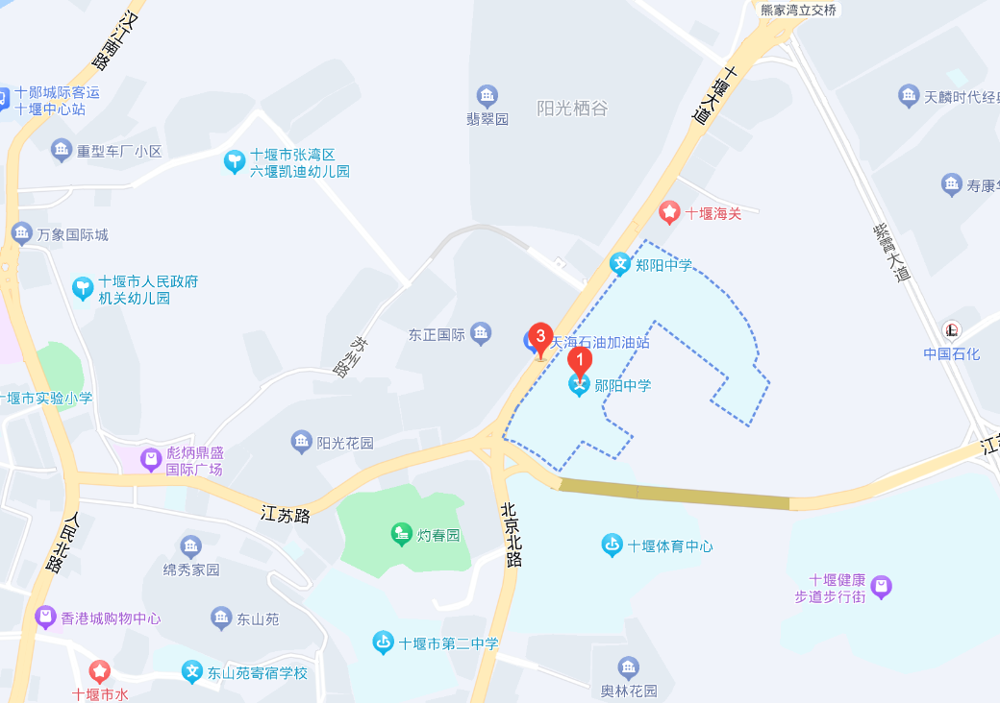
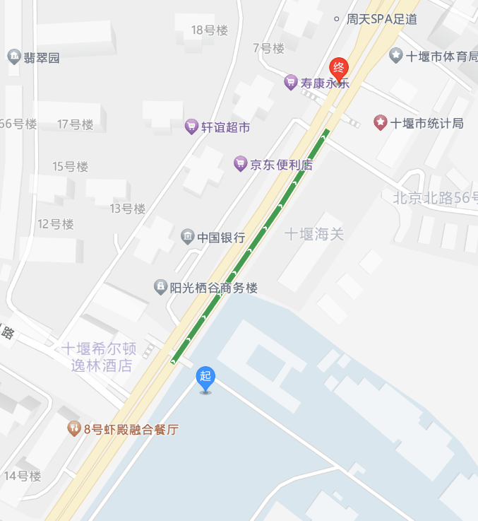
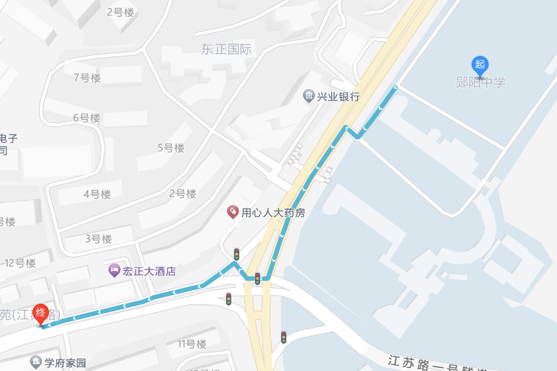
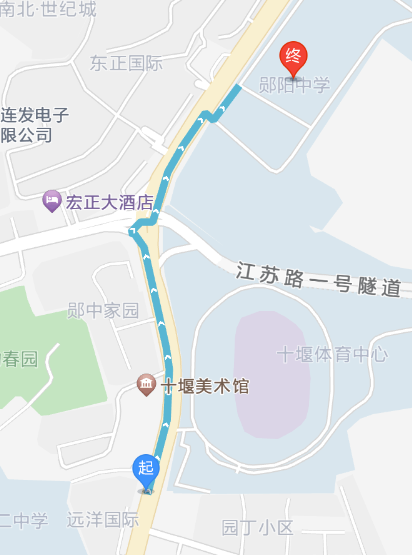

# 交通

## 郧阳中学的地理位置

郧阳中学是三大校里交通最便利的，没有之一。

郧阳中学位于湖北省十堰市北京北路60号，从江苏路上坡到顶直行，从十堰大道上坡快到路口，从北京路下坡到底，~~郧阳中学应该算是三大校里地势最高的了~~ 附地图（截图自百度地图，图中的1号图钉点，请忽略地图上的“郑阳中学”）：校园正门、停车场（后门，高三楼入口）都有天桥

### 公共交通

郧阳中学有自己的公交站台，北-南站台在郧阳中学正门的对面，南-北站台在郧阳中学正门与停车场入口中间位置。停靠车次有：

16路、68路、99路、100路（票价3元，可到郧县）、99路、8路、86路、101路

#### 附近站台

如果您乘坐公交的站点没有直达郧阳中学站点，可以选择如下站点，按照距离从近到远排序：

#### 熊家湾转盘

停靠车次：68、99、16、86、8、81、68、31、21

距离高三楼（停车场入口）较近，一路走上来即可，不用过马路，且公交站处有天桥

附地图：起点为郧阳中学地下停车场 终点为熊家湾转盘公交站，距离251m

如果要到正门，约450m

#### 东正国际

其实就是学校对面的小区的公交站，但由于小区规模较大且建设周期久，所以站点在江苏路，也就是小区最开始的入口

西-->东站点需要向北走并过马路，在站点其实就已经可以看见校园了。

东-->西站点需要往北走，可以一路走到天桥。

停靠车次：28、68、15、18、8、87、85、81、21

距离学校正门距离：约400m

附地图，地图标定的起点为学校正门，终点为东正国际东-->西站点，地图路径仅供参考，请按照实际情况自行规划路线

西-->东站点在地图上的宏正大酒店对面，大概近个60m

#### 其它相对远一点的站点

体育中心站

北京北路，661m

#### 对于五县一市的同学

十堰公交除了100路的票价为3元外，其它的均为2元，希望卡可半价（100路只能按照常规卡打折到2.85元）
关于公交卡的办理请参照[公交卡办理](./../dailylife/transportpass)

如果您来自房县/丹江口市：

来时在客运南站下车，班车正常最终停靠位置是进站口的公交站（房县-十堰为此路线，丹江口市待补充），向前走过小路口，再过大马路会看到一串公交站，公交站上写有停靠车次，可以对照上文的车站信息乘坐，这边建议直达郧阳中学站，因为从这一系列站台到达郧阳中学的车次很多，稍微等等就能等到。

如果您选择打车，费用大约为16元，距离为6.2km。

如果您是家人陪同到校报到并带有大件行李（比如行李箱），更加推荐打车或者自驾，可以避免班车及公交的拥挤和不适（报道还是带个好心情吧）

后续如果有节假日回家的需求，请联系当地汽车站相关工作人员，加入相关群聊进行拼车，在放学时前往中心广场参与点名乘车：

房县：龚艳平 电话：等等我问问我妈

丹江口：待补充

如果您来自郧县：可乘坐100路公交车 同样自驾打车优先

两竹、郧西：待补充

